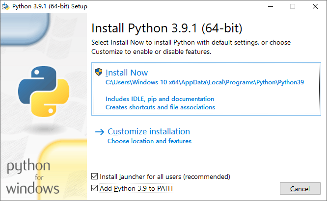
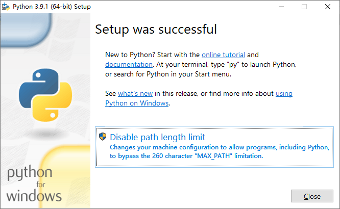

# 基于 Visual Studio Code 的 Python 开发环境部署

## 一、下载和安装 Python

页面说明 | 网址
---  | ---
官网 | <https://www.python.org>
下载 | <https://www.python.org/downloads>
文档 | <https://docs.python.org>

说明：

- 先从下载页面下载安装包，然后运行安装程序，按照向导提示，一步一步完成完成即可。

- 文档里专门有一章叫《Python Setup and Usage》，中文翻译作《安装和使用 Python》，各种操作系统下的安装介绍都有。

Windows 下安装 Python 需要注意两点：

- 先勾选 **Add Python to PATH**，再点击 **Install Now** 进行默认安装：

    

- 安装完毕之后如果看到以下界面，请点击 **Disable path length limit**，启动 Windows 对长路径的支持：

    

## 二、下载和安装 Visual Studio Code

页面说明 | 网址
---  | ---
官网 | <https://code.visualstudio.com>
下载 | <https://code.visualstudio.com/Download>
文档 | <https://code.visualstudio.com/docs>

说明：

- 先从下载页面下载安装包，然后运行安装程序，按照向导提示，一步一步完成完成即可；

- 文档里专门有一章叫《SETUP》，各种操作系统下的安装介绍都有；

- 在以后的文章中，非必要情况下，Visual Studio Code 一律简称 VS Code。

## 三、安装 Python 扩展插件

详情可参考官方文档：[Getting Started with Python in VS Code](https://code.visualstudio.com/docs/python/python-tutorial)
