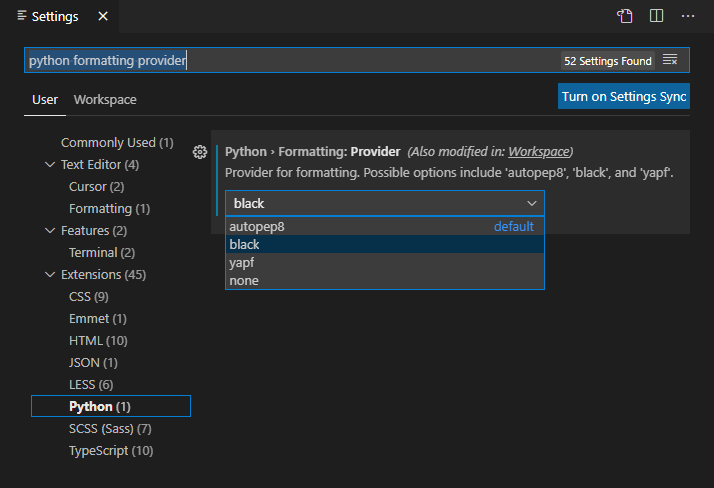

# 在 VS Code 中格式化 Python 代码

## 一、什么是格式化代码？

> 格式化代码，简单来说就是代码的排版，比如调整代码的缩进和间隔之类的，它是最应该做，也是最容易做到的代码规范。

### 为什么应该做？

如果连代码的排版问题都无法达成共识，那像命名规范、设计规范这些更复杂，更高阶的规范就更难制定了。

### 为什么容易做到？

格式化代码，可以借助工具自动完成。

## 二、VS Code 支持的 Python 代码格式化工具

这样的工具有三个：

名称 | Star 数 | 仓库首页
--- | --- | ---
autopep8 | 3.7k | <https://github.com/hhatto/autopep8>
yapf | 11.4k | <https://github.com/google/yapf>
black | 19.4k | <https://github.com/psf/black>

Star 数是 GitHub 上判断仓库热门程度的指标之一，这个数越高，代表该仓库越受关注。

**autopep8** 是包括 VS Code 在内的，很多 Python IDE 默认的排版风格。它所覆盖的代码结构对于初学者来说应该是够用的。但是随着 Python 的流行，不少现实世界里出现的复杂的代码结构逐渐超出了它所考虑的范围，这也成为了一部分人放弃它的理由。

**yapf** 是谷歌的，支持自定义配置是它的优点。如果你认同“谷歌真香”，又或者对自己的代码排版有很多零碎的硬性要求，yapf 将是你不二的选择。

**black** 允许自定义配置的余地很小，但是它所设计的每一项规则，都是团队成员秉承着 Less is more 的设计准则，经过调研决定的。既然已经有人替我筛选出了更好的排版风格，拿来主义不失为一种最好的选择。

## 三、在 VS Code 中配置和使用 black

步骤如下：

1. 安装 Python 扩展插件，详情可参考官方文档《[Getting Started with Python in VS Code](https://code.visualstudio.com/docs/python/python-tutorial)》。

2. 打开设置界面：**主菜单** > **File** > **Preferences** > **Settings**

3. 在 **Search settings** 中输入过滤字：python formatting provider，然后选择 **black** 作为代码格式化工具：

    

4. 打开一个 .py 格式的源代码文件，在右键菜单中选择 **Format Document**，又或者直接使用快捷键 Shift + Alt + F，VS Code 就会调用 black 对当前文件进行重新排版。

5. 如果看到下面的提示，说明当前的开发环境还没有安装 black，点 Yes，耐心等待 VS Code 完成安装即可。

    
